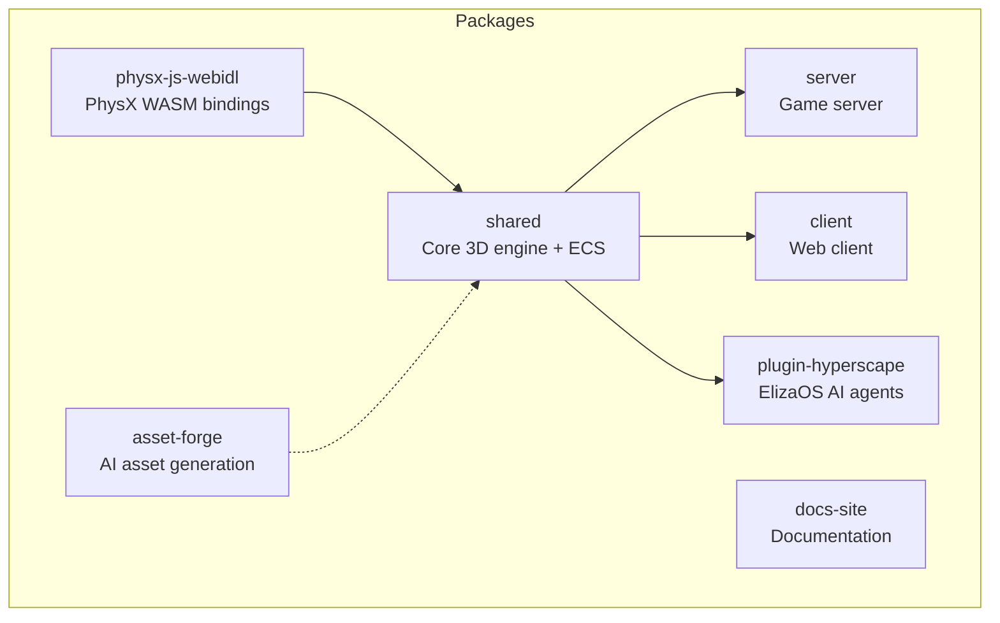
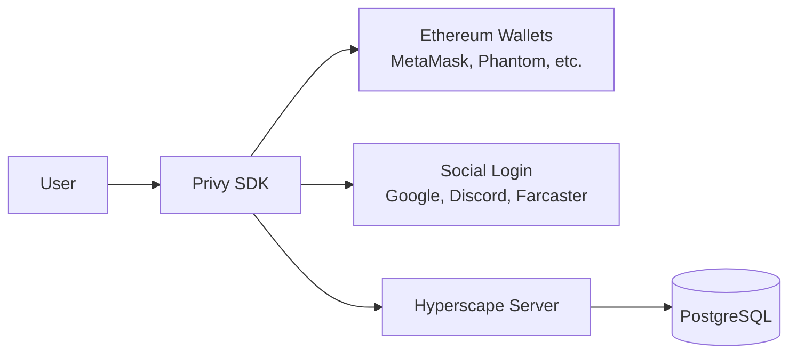

# Hyperscape Deep Dive Analysis

## Project Overview

Hyperscape is an AI-powered RuneScape-style MMORPG built on a heavily modified fork of [Hyperfy](https://github.com/hyperfy-xyz/hyperfy). It combines a real-time 3D engine with ElizaOS AI agents for autonomous gameplay. The project is MIT licensed and actively developed.---

## 1. Architectural Layout

### Monorepo Structure (Turbo-powered)



**Build Order**: `physx-js-webidl` -> `shared` -> everything else (handled by Turbo)

### Core Package: `packages/shared`

The engine is built on an **Entity Component System (ECS)** architecture:| Layer | Location | Purpose ||-------|----------|---------|| **Entities** | `src/entities/` | Game objects (PlayerLocal, PlayerRemote, MobEntity, ItemEntity) || **Systems** | `src/systems/` | Logic processors (CombatSystem, InventorySystem, TileSystem) || **Components** | `src/components/` | Data containers (position, health, inventory) || **Types** | `src/types/` | TypeScript definitions (51 type files) |Key systems split between:

- **Client systems** (`systems/client/`): Graphics, input, camera, networking
- **Server systems** (`systems/server/`): Persistence, bots, authoritative state
- **Shared systems** (`systems/shared/`): Combat, inventory, movement, economy

### Tech Stack Summary

| Component | Technology ||-----------|-----------|| 3D Engine | Three.js 0.180.0 || Physics | PhysX (WASM) || Avatars | VRM format || Server | Fastify + WebSockets || Database | PostgreSQL (production), SQLite (local) || AI Agents | ElizaOS || Auth | Privy (wallet + social) || Build | Turbo + Vite + esbuild |---

## 2. Adding Custom Characters (Your Rigged 3D Files)

### Current Avatar System

Avatars use the **VRM format** (VRM 0.x/1.0). The system is defined in:

- **Avatar options**: [`packages/shared/src/data/avatars.ts`](packages/shared/src/data/avatars.ts)
- **VRM loader**: [`packages/shared/src/systems/client/ClientLoader.ts`](packages/shared/src/systems/client/ClientLoader.ts) (lines 856-948)
- **VRM factory**: [`packages/shared/src/extras/three/createVRMFactory.ts`](packages/shared/src/extras/three/createVRMFactory.ts)

### How to Add Your Custom Avatar

**Step 1**: Convert your rigged model to VRM format

- VRM is based on glTF with humanoid skeleton constraints
- Use VRM tools like [VRM Add-on for Blender](https://vrm-addon-for-blender.info/) or [UniVRM](https://github.com/vrm-c/UniVRM)
- Ensure your rig follows VRM humanoid bone naming conventions

**Step 2**: Place the VRM file in the assets directory

- Location: `packages/server/world/assets/avatars/`
- The CDN serves files from this directory on port 8080

**Step 3**: Register the avatar in the options array

```typescript
// packages/shared/src/data/avatars.ts
export const AVATAR_OPTIONS: AvatarOption[] = [
  // ... existing avatars ...
  {
    id: "your-avatar-id",
    name: "Your Avatar Name",
    url: "asset://avatars/your-avatar.vrm",        // In-game loading
    previewUrl: "http://localhost:8080/avatars/your-avatar.vrm", // Character select
    description: "Your custom avatar description",
  },
];
```

**Difficulty Level**: **Moderate**

- The VRM loading pipeline is well-established
- Main challenge is VRM conversion if your model isn't already VRM
- No code changes required beyond the avatars.ts registration

---

## 3. Adding Custom Buildings

### Current Building/Model System

Buildings and world objects use **GLB/GLTF format** and are loaded via:

- **ModelCache**: [`packages/shared/src/utils/rendering/ModelCache.ts`](packages/shared/src/utils/rendering/ModelCache.ts) - Handles caching and cloning
- **Entity loadModel**: [`packages/shared/src/entities/Entity.ts`](packages/shared/src/entities/Entity.ts) (lines 1170-1258)
- **Environment system**: [`packages/shared/src/systems/shared/world/Environment.ts`](packages/shared/src/systems/shared/world/Environment.ts)

### Manifest-Driven Content System

Hyperscape uses JSON manifests for content definition - **no code changes required**:| Manifest | Location | Purpose ||----------|----------|---------|| NPCs | `world/assets/manifests/npcs.json` | All NPC definitions || Items | `world/assets/manifests/items.json` | All item definitions || Resources | `world/assets/manifests/resources.json` | Trees, rocks, etc. || World Areas | `world/assets/manifests/world-areas.json` | Zone definitions with spawn points |

### How to Add Custom Buildings

**Option A**: As a static world model

- Place GLB in `packages/server/world/assets/models/`
- Reference in world-areas.json or environment configuration

**Option B**: As an interactable entity (bank, shop)

- Add entry to `world-areas.json` with position and NPC/resource reference
- The spawner systems automatically create entities from manifests

**Difficulty Level**: **Easy to Moderate**

- GLB files work out of the box
- Manifest system is well-documented in [`packages/shared/src/data/npcs.ts`](packages/shared/src/data/npcs.ts) comments
- Complex buildings with interactions require manifest entries

---

## 4. Blockchain Integration Status

### Current Implementation: Privy Authentication Only

The blockchain integration is **authentication-focused**, not tokenised gameplay:



**What exists**:

- Wallet-based authentication via Privy ([`packages/client/src/auth/PrivyAuthProvider.tsx`](packages/client/src/auth/PrivyAuthProvider.tsx))
- HD wallet derivation for characters (each character gets derived wallet)
- Farcaster integration for social features
- Wallet addresses stored with characters in database

**What does NOT exist**:

- No on-chain tokens or NFTs
- No smart contracts for items/characters
- No token-gated content
- No play-to-earn mechanics

**Contributor Opportunity**: This is a significant gap if you're interested in Web3 game mechanics. The wallet infrastructure is there, but no blockchain transactions are implemented.---

## 5. Contributor Considerations

### Codebase Quality Assessment

| Aspect | Rating | Notes ||--------|--------|-------|| Documentation | Good | CLAUDE.md, inline comments, typed APIs || Type Safety | Excellent | Strict TypeScript, no `any` allowed || Test Coverage | Moderate | Playwright e2e tests, but gaps in unit tests || Code Organisation | Good | Clear package boundaries, ECS pattern || Build System | Good | Turbo monorepo, fast incremental builds |

### Key Files to Understand

1. **Entry points**: [`packages/shared/src/index.ts`](packages/shared/src/index.ts), [`packages/server/src/index.ts`](packages/server/src/index.ts)
2. **ECS pattern**: [`packages/shared/src/entities/Entity.ts`](packages/shared/src/entities/Entity.ts)
3. **Combat system**: [`packages/shared/src/systems/shared/combat/CombatSystem.ts`](packages/shared/src/systems/shared/combat/CombatSystem.ts)
4. **Networking**: [`packages/shared/src/systems/client/ClientNetwork.ts`](packages/shared/src/systems/client/ClientNetwork.ts)

### Development Workflow

```bash
bun install          # Install dependencies
bun run build        # Build all packages (required first time)
bun run cdn:up       # Start asset CDN (Docker)
bun run dev          # Start client + server with hot reload
bun run dev:ai       # Include ElizaOS agents
```


### Contribution Areas

Based on the codebase analysis:

1. **Web3 Features** - Token/NFT integration infrastructure exists but unused
2. **Content Creation** - JSON manifests make adding NPCs/items accessible
3. **AI Agents** - ElizaOS plugin is active development area